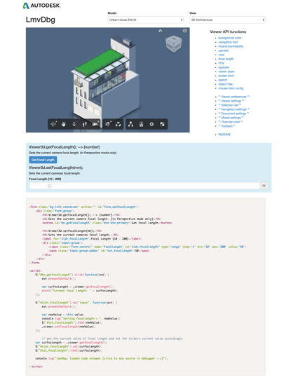

# LmvDbg Test App

Designed to test out all the API functions of the LMV Viewer. You can use as a learning and diagnostic tool for the APIs and to steal source code snippets to jumpstart your own app.

The models available to use are hardwired into the code and rely on the ConsumerKey and ConsumerSecret keys for this app.  If you want to add your own models, you will have to get them translated to produce your unique URNS.  Then you will need to swap out the AuthTokenServer reference in MyAuthToken.js (currently pointing to my token service).  If you need suggestions on how to create your own AuthTokenService, there is a template service [here](https://github.com/Developer-Autodesk/AuthTokenServer_Simple.git) for you to use:  

See the README file that is part of the live app (by clicking on the README link) for more details on how to use this app.

## Demo
[Live Demo](http://developer-autodesk.github.io/view.and.data-javascript-lmvdbg.tool/)

## Deploy

## Usage
Just click on the links on the right of the page to see sample codes associated with each viewer functionalities.
